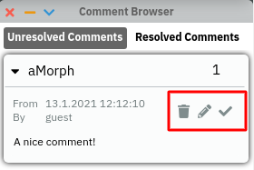
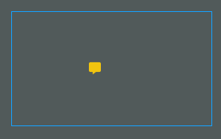

# lively.collab

`lively.collab` is a collection of tools for collaboration in `lively.next`.

## Comments

It provides functionality to comment on any morph in the world. It provides functionality to comment on any morph in a world. Comments are objects that include a text, a timestamp, a relative morph position and the user that created it.

### Adding Comments

To add a comment to a morph open the morph menu on it (either via right-click or through the menu-halo) and choose "Add comment".

### The Comment Browser

Most of the functionality of comments is available through the Comment Browser that can be opened via the topbar.

The browser displays all comments currently existing in the world grouped by the morph the comment belongs to. Clicking on a comment will highlight the morph it belongs to in the world.

#### Actions on Comments

For each comment the highlighted buttons allows to

- delete the comment
- edit the text of the comment
- resolve the comment (see below).

When editing a comment it is important to actually saving the changes with the "Save" button that appears when editing.

#### Comment Indicators

When the browser is opened, each comment is indicated in the world through a comment indicator. These indicators have positions relative to the morph the comment belongs to and can be moved. This allows to attach comments to specific locations of a morph. Clicking on an indicator highlights the corresponding comment in the browser.

#### Resolving Comments

By clicking the "Resolve" button for a comment it can marked as such. Resolved comments will be shown in the corresponding tab of the browser. When that tab is activated the indicators of the resolved comments whill be shown and their color is blue. In this tab comments can also be marked as unresolved again. The badge in the topbar will count the number of **unresolved comments** in the world.

### Programmatically Interacting With Comments

The above described way to interact with the comments via GUI is the only supported way to interact with comments. That means programmatically interacting with them (e.g., removing comments through code) may get your world in an inconsistent state and break things!